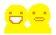
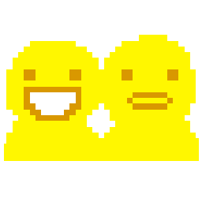

#  PesterChum 6.0, _version 0.1_

A non-functional recreation of the [MSPA][] [PesterChum][page that shows PesterChum] 6.0 client.

There's actually a functional client [over here](https://github.com/illuminatedwax/pesterchum), but it takes some liberties with the UI.

## Run

There's not much to see here, but if you have Node.js, you can clone the project and run `npm i` and `npm start`

# Doc Scratch Reaction GIF Generator

**EPILEPSY WARNING**

[Generate text GIFs][Reaction GIF Generator] in the style of [an astounded and furious Doc Scratch][angry Doc Scratch].

[MSPA]: http://www.mspaintadventures.com/
[page that shows PesterChum]: http://www.mspaintadventures.com/?s=6&p=002010
[angry Doc Scratch]: http://www.mspaintadventures.com/?s=6&p=004163
[Reaction GIF Generator]: https://rawgit.com/1j01/pesterchum/master/app/reaction/test.html

